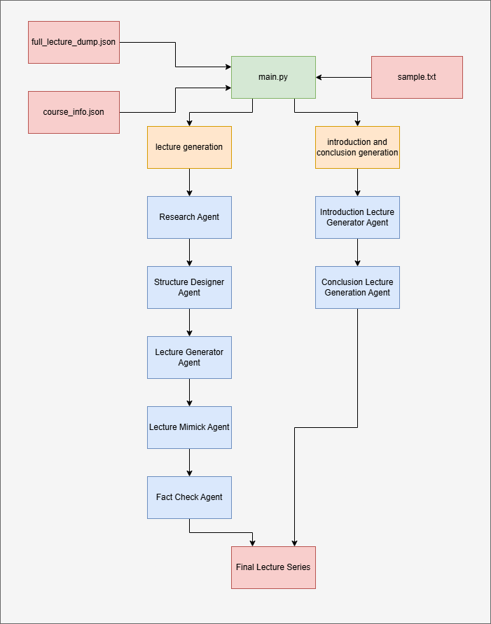

# Lecture & Module Generator

## Overview
This project automates the generation of lecture content, module introductions, and conclusions for educational courses. It processes structured text files and outputs organized JSON files and text dumps for further use or publication.

## Workflow Diagram
The following flowchart illustrates the overall workflow of the project, from input files to generated outputs:



1. The script inputs the course info file, the full course structure file and a sample lecture text from which it mimicks.
2. The lecture generation file will first use a research agent to gather important information from the topic content which is stored in the `full_lecture_dump.json`.
3. The structure designer will use a short summary of the previous lecture of it's module(the modules and the lecture structure is monitored by the script), the important information gathered by the research agent and a short information of the next lecture in the module, and produce a structured lecture format.
4. The lecture generator agent will then convert the structured lecture into a natural sounding transcript, and finally to produce a realistic lecture, the mimicker agent will use sample lecture as a reference and produce a final lecture.
5. Finally, a fact check agent compares the lecture with the topic content and correct or improvise if anything is required.
6. The output is structured inside the `lectures` folder according the the module number. 
7. The main lecture part is complete. Now, to produce the introductions and conclusions for each modules and the course as a whole, another script file, introduction and conclusion generation starts working. First it analyzes the course structure, keeping track of module names and number.
8. If the module if the first one, it will generate the introductions and the conclusions accordingly. Otherwise, it retreives a small summary of previous module and next module and describe it in its script in a short way. 
9. Once all the modules have their introduction and conclusion scripts, it will generate a introduction and conclusion lectures for the whole course.
10. The output is stored inside the same `lectures` folder along with other lectures.

## Directory Structure
```
merge_gen - Copy/
├── generate_lectures.py                  # Script to generate lecture content
├── generate_module_intro_conclusion.py   # Script to generate module intros/conclusions
├── main.py                              # Main entry point (orchestrator)
├── inputs/                             # Input files for the lecture generation.
│   ├── course_info.json
│   ├── full_lecture_dump.json
│   └── sample.txt
├── lectures/                            # Output lectures.
│   └── ...
└── secrets.toml                         # API keys or configuration secrets

```

## Setup Instructions
1. **Python Version:**
   - Requires Python 3.7 or higher.

2. **Install Dependencies:**
   - (If dependencies are required, add a `requirements.txt` and run:)
   ```bash
   pip install -r requirements.txt
   ```
   - If no requirements file is present, ensure standard Python libraries are available.

3. **Configure Secrets:**
   - Add your API keys or configuration to `secrets.toml` as needed by the scripts.
   ```bash
   [openai]
   api_key = ""   
   ```

## Usage
### 1. Generate Lectures
Run the following command to generate lecture content:
```bash
python generate_lectures.py
```
- This will input files from `inputs/` and generate the lectures at `lectures/`

### 2. Generate Module Introductions & Conclusions
Run:
```bash
python generate_module_intro_conclusion.py
```
- This script generates introductions and conclusions for each module, using the files in `lectures/`.

### 3. Main Orchestration (if applicable)
The script first runs `generate_lectures.py` and then `generate_module_intro_conclusion.py` creating a full lecture series
If `main.py` is used as an orchestrator, run:
```bash
python main.py
```

## Inputs
- **course_info.json:** Contains structured information about the course.
- **full_lecture_dump.json:** Contains the full generated topic and module content.
- **sample.txt:** Contains the lecture style to be mimicked.

## Notes
- Ensure all input files are UTF-8 encoded.
- Review `secrets.toml` for any required API keys or configuration.
